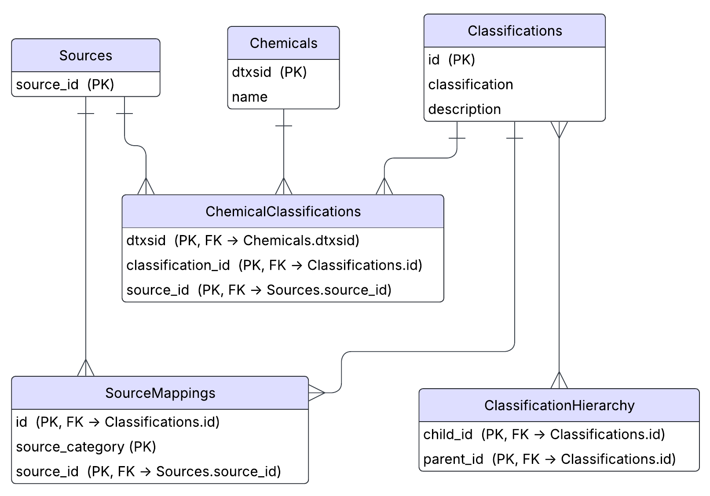

# Chemical Functional Use Taxonomy (ChemFUT)

The Analytical Methods and Open Spectra (AMOS) Database's Chemical Functional Use Taxonomy (ChemFUT) contains mappings between chemicals (via name and DTXSID) and their functional uses. This repository contains a snapshot of the SQLite database and a Python class to help query the database.

## ChemFUT Database

A snapshot of the data is contained in `data/ChemFUT.db`. Here is an ER diagram representation of the database.



Descriptions of each table and their variables follow:

| Table | Description |
|-------|-------------|
| Sources | Contains unique identifiers for each source that data was pulled from. |
| Chemicals | Maps the unique chemical identifier (DTXSID) to its chemical name. |
| Classifications | Maps a unique classification ID to a human readable class name (e.g., Pharmaceuticals) and a description of that class. |
| ChemicalClassifications | Maps chemicals (by DTXSID) to their classifications, and which source that classification came from. |
| SourceMappings | Contains the raw category pulled from a given source mapped to a harmonized ChemFUT class. |
| ClassificationHierarchy | Contains parent/child mappings for each classification. |

### Sources Table

| Variable | Role | Description |
|----------|------|-------------|
| source_id | PK  | A unique identifier for each source. E.g., "wikipedia", "drugbank". |

### Chemicals Table

| Variable | Role | Description |
|----------|------|-------------|
| dtxsid   | PK   | The unique DTXSID for each chemical. |
| name     |      | The EPA's preferred name for each chemical. |

### Classifications Table

| Variable | Role | Description |
|----------|------|-------------|
| id       | PK   | A unique identifier for each classification of the form func_0001. |
| classification || A human readable name for each classification (e.g., Pharmaceuticals). |
| description |   | A description for each classification. |

### ChemicalClassifications Table

| Variable | Role | Description |
|----------|------|-------------|
| dtxsid   | CPK, FK $\rightarrow$ `Chemicals.dtxsid` | The unique DTXSID chemical identifier. |
| classification_id | CPK, FK $\rightarrow$ `Classifications.id` | A unique identifier for each classification. |
| source_id | CPK, FK $\rightarrow$ `Sources.source_id` | The unique source_id for each source. |

### SourceMappings Table

| Variable | Role | Description |
|----------|------|-------------|
| id       | CPK, FK $\rightarrow$ `Classifications.id` | A unique identifier for each classification. |
| source_category | CPK | The raw category pulled from the source that was mapped to the given `id`. |
| source_id | CPK, FK $\rightarrow$ `Sources.source_id | The unique source_id for each source. |

### ClassificationHierarchy

| Variable | Role | Description |
|----------|------|-------------|
| child_id | CPK, FK $\rightarrow$ `Classifications.id` | The unique classification identifier for the child node. |
| parent_id | CPK, FK $\rightarrow$ `Classifications.id` | The unique classification identifier for the parent node. |

## Usage

For the chemFUT.ChemFUTHelper class to work by default, you must use the following directory structure:


For more information about any given method and its parameters, check the respective docstring in the source code.

### Connecting to ChemFUT.db

If using the recommended directory structure, the path to ChemFUT.db is correctly set within the `sqlite_handler.SqliteHandler.chem_func_uses_path` attribute such that instantiating an instance of `chemFUT.ChemFUTHelper` will automatically connect to the database and set the resulting `sqlite3.Connection` and `sqlite3.Cursor` objects to the `chemFUT.ChemFUTHelper.conn` and `chemFUT.ChemFUTHelper.cursor` attributes, respectively.

```python
from chemFUT import ChemFUTHelper

FuncDB = ChemFUTHelper()
```

If using a different directory structure, you can specify the path of your `.db` file when instantiating `chemFUT.ChemFUTHelper` as a string or a `pathlib.Path` object.

```python
FuncDB = ChemFUTHelper("./path/to/ChemFUT.db")
```

### Print Database/Table Descriptions

#### ChemFUTHelper.print_db_description()

This method will print a description of each table with its columns to the console.

```python
FuncDB = ChemFUTHelper()
FuncDB.print_db_description()
```

Example output:

```dummy
Table: Chemicals
  Column: dtxsid, Type: TEXT, Not Null: 0, Default: None, Primary Key: 1
  Column: name, Type: TEXT, Not Null: 1, Default: None, Primary Key: 0
 ----------------------------------------
Table: Classifications
  Column: id, Type: TEXT, Not Null: 0, Default: None, Primary Key: 1
  Column: classification, Type: TEXT, Not Null: 1, Default: None, Primary Key: 0
  Column: description, Type: TEXT, Not Null: 0, Default: None, Primary Key: 0
----------------------------------------
Table: ChemicalClassifications
  Column: dtxsid, Type: TEXT, Not Null: 1, Default: None, Primary Key: 1
  Column: classification_id, Type: TEXT, Not Null: 1, Default: None, Primary Key: 2
  Column: source_id, Type: TEXT, Not Null: 1, Default: None, Primary Key: 3
----------------------------------------
Table: ClassificationHierarchy
  Column: child_id, Type: TEXT, Not Null: 1, Default: None, Primary Key: 1
  Column: parent_id, Type: TEXT, Not Null: 0, Default: None, Primary Key: 2
----------------------------------------
Table: SourceMappings
  Column: id, Type: TEXT, Not Null: 1, Default: None, Primary Key: 1
  Column: source_category, Type: TEXT, Not Null: 1, Default: None, Primary Key: 2
  Column: source_id, Type: TEXT, Not Null: 1, Default: None, Primary Key: 3
----------------------------------------
Table: Sources
  Column: source_id, Type: TEXT, Not Null: 1, Default: None, Primary Key: 1
----------------------------------------
```

#### ChemFUTHelper.print_table()

This method will print the contents of a table from the database. The user specifies the number of rows they want printed. To print the first 10 rows of the `SourceMappings` table:

```python
FuncDB = ChemFUTHelper()
FuncDB.print_table(table_name="SourceMappings", limit=10)
```

To print every row of the `Sources` table:

```python
FuncDB = ChemFUTHelper()
FuncDB.print_table(table_name="Sources", limit=None)
```

### Making Queries

#### ChemFUTHelper.query_hierarchy_paths()

This method will return every possible hierarchical path starting from each root node. The returned data structure is by default a tuple of two lists of strings. The first list contains the paths with the classes encoded with their classification id (e.g., func_0004), the second list contains the paths with the class names. Each element represents one possible path (e.g., ['Drugs -> Pharmaceuticals -> Respiratory Drugs -> Anti-allergic Agents', 'Drugs -> Pharmaceuticals -> Respiratory Drugs -> Anti-allergic Agents -> Antihistamines']). Notice that the delimiter ' -> ' points from parent to child.

This method might be useful for further processing, things like determining the longest path from a root node to a leaf node.

```python
FuncDB = ChemFUTHelper()
id_paths, class_name_paths = FuncDB.query_hierarchy_paths()
```

#### ChemFUTHelper.get_chem_name()

Takes a DTXSID as a required parameter and returns the chemical name.

```python
FuncDB = ChemFUTHelper()
dtxsid = "DTXSID9020112"
chem_name = FuncDB.get_chem_name(dtxsid)
print(chem_name)
```

> Atrazine

#### ChemFUTHelper.get_class_id_from_name()

Takes a class name and returns its class id.

```python
FuncDB = ChemFUTHelper()
class_name = "Pharmaceuticals"
class_id = FuncDB.get_class_id_from_name(class_name)
print(class_id)
```

> func_0231

#### ChemFUTHelper.get_class_name_from_id()

Takes a class id and returns its name.

```python
FuncDB = ChemFUTHelper()
class_id = "func_0231"
class_name = FuncDB.get_class_id_from_name(class_id)
print(class_name)
```

> Pharmaceuticals

#### ChemFUTHelper.get_chem_classes()

Returns the classes that a chemical (from DTXSID) is a member of. This method is fairly robust in that it allows many alterations of your output through the optional parameters.

It should be noted that the hierarchy of classes is not retained in the returned value - it is either a list of classes or a semicolon delimited string.

To return all classes that Atrazine is a member of, from all sources:

```python
FuncDB = ChemFUTHelper()
dtxsid = "DTXSID9020112"
atrazine_classes = FuncDB.get_chem_classes(dtxsid)
print(atrazine_classes)
```

> Additives; Biocides; Biologicals; Fertilizers; Herbicides; Hormones; Industrial Chemicals; Pesticides; Soil Additives; Xenohormones

To only get the classes for Atrazine that came from APPRIL in a list:

```python
FuncDB = ChemFUTHelper()
dtxsid = "DTXSID9020112"
atrazine_classes = FuncDB.get_chem_classes(dtxsid, sources=["appril"], as_str=False)
print(atrazine_classes)
```

> ['Additives', 'Biocides', 'Fertilizers', 'Herbicides', 'Industrial Chemicals', 'Pesticides', 'Soil Additives']

To return the classification IDs instead of the class names:

```python
FuncDB = ChemFUTHelper()
dtxsid = "DTXSID9020112"
atrazine_classes = FuncDB.get_chem_classes(dtxsid, names=False, sources=["appril"], as_str=False)
print(atrazine_classes)
```

> ['func_0005', 'func_0087', 'func_0153', 'func_0181', 'func_0189', 'func_0227', 'func_0269']

#### ChemFUTHelper.get_class_parents

Returns the direct parents of a given class (accepts either class name or class id).

```python
FuncDB = ChemFUTHelper()
class_name = "Antinematodal Agents"
parents = FuncDB.get_class_parents(class_name)
print(parents)
```

> ['Anthelmintics', 'Nematicides']

#### ChemFUTHelper.get_class_children()

Returns the direct children of a given class (accepts either class name or class id).

```python
FuncDB = ChemFUTHelper()
class_name = "Biocides"
children = FuncDB.get_class_parents(class_name)
print(children)
```

> ['Acaricides', 'Algicides', 'Antifouling Agents', 'Antimicrobial Agents', 'Antimycotics', 'Antiparasitics', 'Avicides', 'Chemosterilants', 'Fumigants', 'Fungicides', 'Fungistats', 'Herbicides', 'Insecticides', 'Molluscicides', 'Nematicides', 'Spermicides', 'Sporicide', 'Sterilizing Agents']

#### ChemFUTHelper.export_db_to_excel()

This method generates a data dump of `ChemFUT.db` in the form of a `.xlsx` file. This requires the openpyxl library.

```python
FuncDB = ChemFUTHelper()
FuncDB.export_db_to_excel("./path/to/ChemFUT_datadump.xlsx")
```
